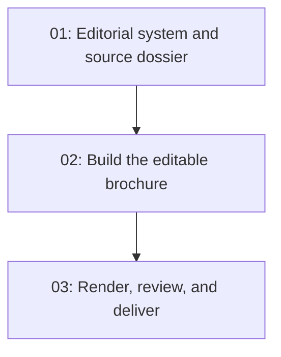

# La Palmerina Vertical Commercial Brochure

## Overview

Create a polished, editable A4 portrait PowerPoint brochure for Paseo Comercial La Palmerina, using only the commercial facts, visual identity, contact link, and image assets already present in the rental page.

## Quick Links

- [Requirements](./requirements.md) - full requirements and acceptance criteria
- [Action Required](./action-required.md) - manual steps needing human action

## Dependency Graph

## Waves

| Wave | Tasks | Description |
|------|-------|-------------|
| 1 | task-01 | Establish the sourced narrative, image plan, and portrait design system |
| 2 | task-02 | Build the complete editable ten-page PowerPoint brochure |
| 3 | task-03 | Render, inspect, correct, verify, and prepare the final deliverable |

## Task Status

### Wave 1
- [x] [task-01-editorial-system](./tasks/task-01-editorial-system.md) - Create the source dossier and design direction

### Wave 2
- [x] [task-02-build-brochure](./tasks/task-02-build-brochure.md) - Build the A4 portrait brochure

### Wave 3
- [x] [task-03-qa-delivery](./tasks/task-03-qa-delivery.md) - Complete visual and mechanical QA
